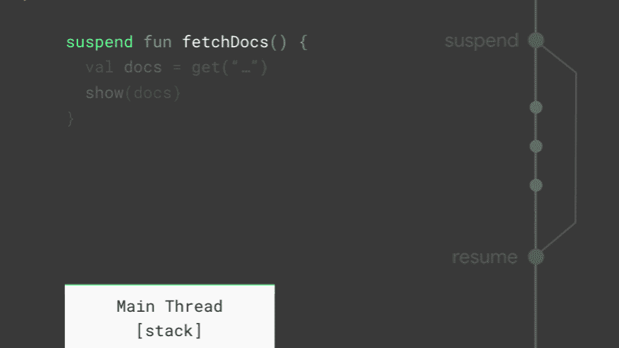

========================
Android Kotlin Corotines
========================
==================
What is Coroutines
==================
A coroutine is a concurrency design pattern that you can use on Android to simplify code that executes asynchronously. Coroutines were added to Kotlin in version 1.3 and are based on established concepts from other languages.

On Android, coroutines help to solve two primary problems:

1. Manage long-running tasks that might otherwise block the main thread and cause your app to freeze.
2. Providing main-safety, or safely calling network or disk operations from the main thread.

This topic describes how you can use Kotlin coroutines to address these problems, enabling you to write cleaner and more concise app code.

====================
Coroutines in Kotlin
====================

On Android, it's essential to avoid blocking the main thread. The main thread is a single thread that handles all updates to the UI. It's also the thread that calls all click handlers and other UI callbacks. As such, it has to run smoothly to guarantee a great user experience.

For your app to display to the user without any visible pauses, the main thread has to update the screen every 16ms or more, which is about 60 frames per second. Many common tasks take longer than this, such as parsing large JSON datasets, writing data to a database, or fetching data from the network. Therefore, calling code like this from the main thread can cause the app to pause, stutter, or even freeze. And if you block the main thread for too long, the app may even crash and present an Application Not Responding dialog.

=================
Suspend work flow
=================

   Suspend method work flow.
